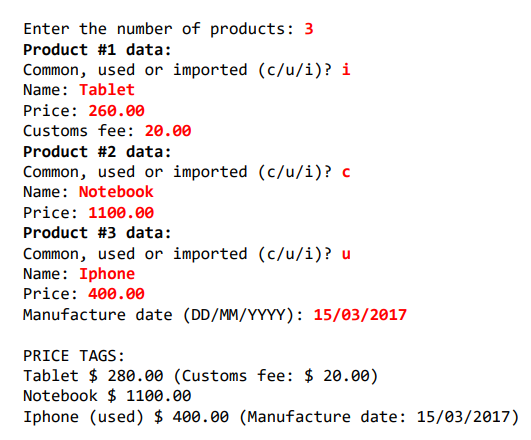

# Fazer um programa para ler os dados de N produtos (N fornecido pelo usuário). Ao final, mostrar a etiqueta de preço de cada produto na mesma ordem em que foram digitados.
# Todo produto possui nome e preço. Produtos importados possuem uma taxa de alfândega, e produtos usados possuem data de fabricação. Estes dados específicos devem ser acrescentados na etiqueta de preço conforme exemplo nas imagens abaixo. Para produtos importados, a taxa e alfândega deve ser acrescentada ao preço final do produto.
# Implementar o programa da MESMA maneira da imagem abaixo.
#
#
#
###### Modelo de como deve ser criado as classes e métodos: 

###### Modelo de como deve ficar o terminal de comando ao executar o programa:

